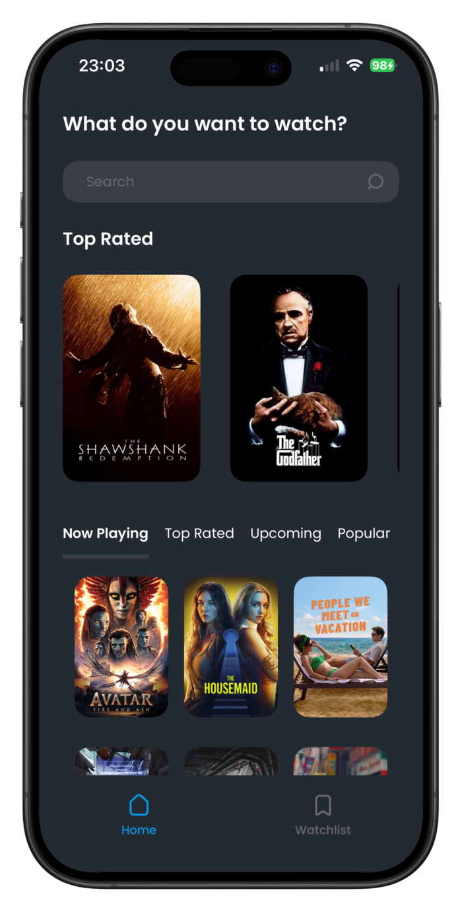
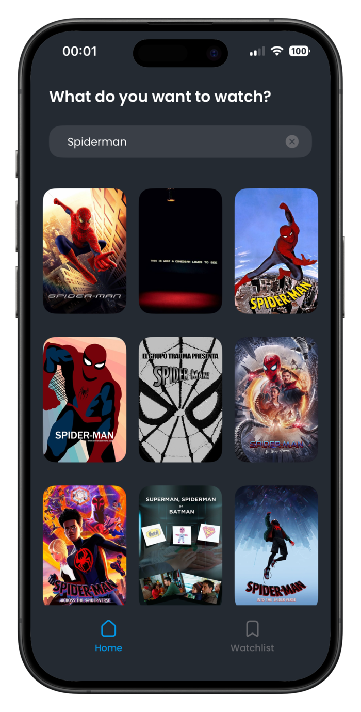
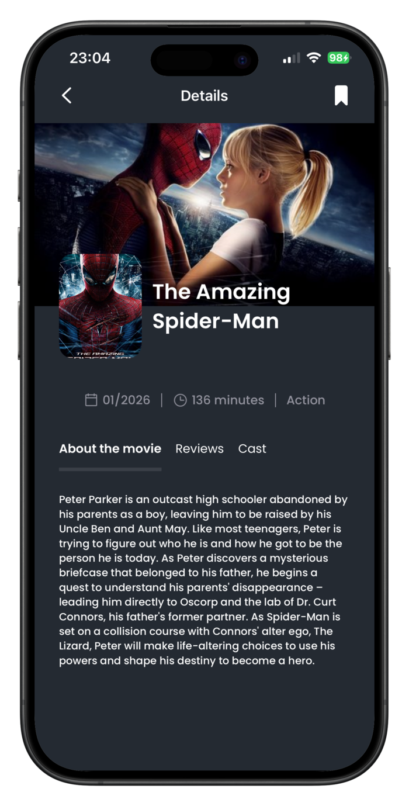
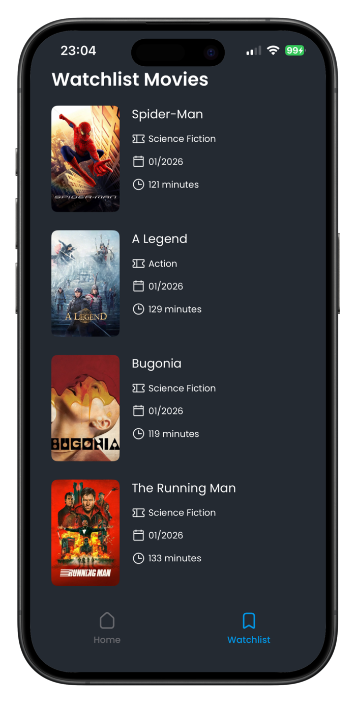

# Movie discovery iOS App (SwiftUI + TMDB)
An iOS application for searching, discovering and saving movies.

---

## Description
This project is a SwiftUI-based iOS app designed to help users explore new movies and manage a personal watchlist.  
It focuses on movie discovery through curated categories, search functionality, and local persistence for offline access.  
The app integrates with the TMDB API to fetch up-to-date movie data, including ratings, cast information, and reviews. 

___

## Features
- Search movies by title with real-time results
- Discover movies across multiple categories:
  - Now Playing
  - Top Rated
  - Upcoming
  - Popular
- View detailed movie information, including reviews and cast
- Save movies locally for offline access

---

## Getting Started
- Make sure you have XCode version 16.0 or above installed
- Clone the project in XCode
- Open the project
- Register at TMDB website to get API key
- Open MovieApp/Core/Utilities folder
  - Go to Secret.example file, paste your API key there
  - Rename the file name to just Secret
- Run the project

---

## Tech Stack
- Language: Swift
- UI: SwiftUI
- Persistence: SwiftData
- Networking: URLSession with a generic, reusable networking layer
- Architecture: MVVM
- Reactive utilities: Combine
- UIKit used where SwiftUI interoperability is required

---

## Architecture

The app follows a modular MVVM architecture with clear separation of concerns:

- **Core**: Reusable services, utilities, extensions, DI container, networking, and persistence  
- **Features**: Feature-specific UI, domain logic, DTOs, protocols, and view models  
- **Networking**: Protocol-oriented, generic networking layer abstracts all API requests and handles decoding and errors  
- **Persistence**: Local storage using SwiftData for offline access  
- **Presentation Layer**: SwiftUI views with MVVM view models; custom components for reusable UI patterns  

This structure ensures scalability, testability, and maintainability across the app.

---

## Limitations
- No user authentication or cloud synchronization
- Basic error handling
- UI optimized for iPhone only

## Screenshots

  
  
  
  

  Home · Search · Details · Saved

